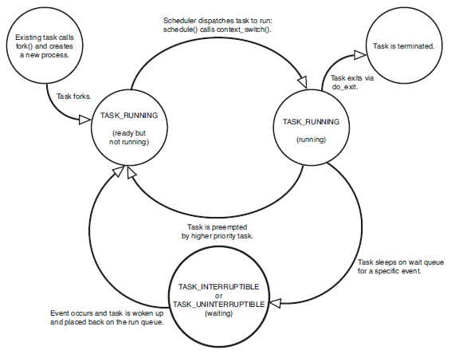

# 进程管理

> Linux Kernel Development ch3: Process Management

## 进程

进程(process)是运行过程中的程序。但进程不仅仅局限于可执行的程序代码，还包括一系列资源，比如打开的文件、等待中的信号、内核数据、处理器状态、一个或多个具有内存映射的内存地址空间、一个或多个执行线程，还有包含全局数据的数据段等。

执行线程简称线程，是进程中的活动对象。每个线程包含唯一的程序计数器、进程栈和一组进程寄存器。传统UNIX系统中，一个进程包含一个线程，在现代系统中，多线程程序是非常常见的。

现代操作系统中，进程提供两种虚拟化技术：虚拟处理器和虚拟内存。实际上可能多个进程共享一个处理器，但虚拟处理器给进程一种假象，让这些进程感觉自己独享处理器。虚拟内存让进程分配和管理内存时觉得自己拥有整个系统的所有内存资源。

!!! info
    有趣的是，线程之间可以共享虚拟内存，但每个线程都拥有各自的虚拟处理器。

## 进程描述符及任务结构

头文件`<linux/sched.h>`中定义了`struct task_struct`

进程描述符是通过slab分配器动态生成的，所以通常使用`struct thread_info`存储相关信息，并将thread_info放置在进程栈的尾部，通过其中的`*task`指针获得`task_struct`的真实地址。

```c
struct thread_info {
    struct task_struct *task;
    struct exec_domain *exec_domain;
    __u32 flags;
    __u32 status;
    __u32 cpu;
    int preempt_count;
    mm_segment_t addr_limit;
    struct restart_block restart_block;
    void *sysenter_return;
    int uaccess_err;
};
```

### PID

- PID: process identification

最大进程数：/proc/sys/kernel/pid_max

当前进程信息被存放至`current`宏中，可以通过以下方式得到

```c
current_thread_info()->task;
```

对于`x86`架构，其寄存器较少，所以当前`task_struct`被存放在`thread_info`中，而有些处理器，比如PowerPC，它富含寄存器，通常会将当前`task_struct`存入寄存器`r2`。

### 进程态

- TASK_RUNNING: 运行态，唯一可以执行用户空间程序的状态
- TASK_INTERRUPTIBLE: 可中断，进程休眠(blocked)中，可以通过信号唤醒
- TASK_UNINTERRUPTIBLE: 不可中断，等待某特定条件后自动唤醒，无法通过信号唤醒
- __TASK_TRACED: 处于被追踪状态，例如`strace process`
- __TASK_STOPPED: 进程接收到`SIGSTOP`, `SIGTSTP`, `SIGTTIN`, `SIGTTOU`等信号后进行该状态，或者在调试过程中接收到任何信号也会进入该状态



内核代码经常修改进程态，首选机制是

```c
set_task_state(task, state);
```

这等价于

```c
task->state = state;
```

### 进程上下文

正常进程执行时处于用户空间，当进程执行 **系统调用** (system call)或者触发异常情况时，会进入内核空间。这种情况被称之为

!!! note "process context"
    At this point, the kernel is said to be “executing on behalf of the process” and is in process context

在进程上下文时，`current`宏是有效的。

### 进程家族树

除`init`进程外，每个进程都有一个父进程，有0个或若干个子进程.

下面的程序可以迭代某个进程的所有子进程

```c
struct task_struct *task;
struct list_head *list;

list_for_each(list, &current->children) {
    task = list_entry(list, struct task_struct, sibling);
    /* task now points to one of current’s children */
}
```

从任意进程都可以获取到`init`进程

```c
struct task_struct *task;

for (task = current; task != &init_task; task = task->parent);
/* task now points to init */
```

由于task list被存放于一个循环双端链表中，所以从任意进程都可以遍历到其它所有进程。

```c
list_entry(task->tasks.next, struct task_struct, tasks); // next
list_entry(task->tasks.prev, struct task_struct, tasks); // previous
```

当然也可以使用`for_each_process(task)`遍历所有进程。

```c
struct task_struct *task;

for_each_process(task) {
    /* this pointlessly prints the name and PID of each task */
    printk("%s[%d]\n", task->comm, task->pid);
}
```

## 进程创建

Unix系统使用`fork`创建进程，一次创建，两次返回。返回值为0代表新创建的子进程；返回大于0代表父进程，返回值为子进程的PID。

在fork后，可以通过`exec`系列函数去执行新的程序。

### 写时拷贝

传统情况下，`fork`会将父进程的所有资源都拷贝到新创建的子进程，这是非常低效而且耗费资源的。很多情况下，子进程创建后会立刻调用`exec`去执行新的可执行文件，这将导致拷贝的所有数据都失效，这就更加浪费时间和资源。

因此有了写时拷贝(Copy-on-Write), 只有真的需要写入数据时才会拷贝一份，否则以只读方式与父进程共享资源。如果资源从来没有需要重新写入的话，就不需要拷贝。

`fork`必须执行的是拷贝父进程的页表信息以及创建子进程描述符。写时拷贝避免了大量数据的拷贝，大大优化了fork效率。

!!! note
    `exec`系列函数包括：`execl`, `execlp`, `execle`, `execv`, `execvp`, `execvpe`

### Forking

```yml
fork -> clone -> do_fork(kernel/fork.c) -> copy_process -> dup_task_struct
                                                |--------> copy_flags
                                                |--------> alloc_pid
```

### vfork

vfork 与 fork相似，但主要是为子进程立即执行exec()程序而专门设计的。

1. 无需为子进程复制虚拟内存页或页表，子进程共享父进程的内存
2. 在子进程调用exec()或_exit()之前，将暂停执行父进程

vfork 是早期没有实现COW(copy-on-write)技术时的优化方案，目前已经基本不用了，除非特殊需求，否则不应该再使用vfork.

## 线程

Linux内核中其实没有线程Thread的概念，内核对待线程就和普通进程是一样的，内核没有针对线程提供任何特定的调度算法或者数据结构。线程可以认为是进程共享资源的一种方式，每个线程在内核中和进程一样，有唯一的task_struct.

### 创建线程

线程的创建基本和进程一样，除了调用`clone()`时会指定特定的共享资源。

```c
clone(CLONE_VM | CLONE_FS | CLONE_FILES | | CLONE_SIGHAND, 0);
```

这段代码表明了父子进程共享地址空间，文件系统，文件描述符，信号处理程序。新建的进程及其父进程就是所谓的线程。

对比下普通的fork实现：

```c
clone(SIGCHLD, 0);
```

还有 vfork 的实现：

```c
clone(CLONE_VFORK | CLONE_VM | SIGCHLD, 0);
```

更详细的共享信息如下表所示：

| Flag | Meaning |
|:---|:---|
| CLONE_FILES | Parent and child share open files. |
| CLONE_FS | Parent and child share filesystem information. |
| CLONE_IDLETASK | Set PID to zero (used only by the idle tasks). |
| CLONE_NEWNS | Create a new namespace for the child. |
| CLONE_PARENT | Child is to have same parent as its parent. |
| CLONE_PTRACE | Continue tracing child. |
| CLONE_SETTID | Write the TID back to user-space. |
| CLONE_SETTLS | Create a new TLS for the child. |
| CLONE_SIGHAND | Parent and child share signal handlers and blocked signals. |
| CLONE_SYSVSEM | Parent and child share System V SEM_UNDO semantics. |
| CLONE_THREAD | Parent and child are in the same thread group. |
| CLONE_VFORK | vfork() was used and the parent will sleep until the child wakes it. |
| CLONE_UNTRACED | Do not let the tracing process force CLONE_PTRACE on the child. |
| CLONE_STOP | Start process in the TASK_STOPPED state. |
| CLONE_SETTLS | Create a new TLS (thread-local storage) for the child. |
| CLONE_CHILD_CLEARTID | Clear the TID in the child. |
| CLONE_CHILD_SETTID | Set the TID in the child. |
| CLONE_PARENT_SETTID | Set the TID in the parent. |
| CLONE_VM | Parent and child share address space. |

### 内核线程

内核经常需要在后台执行一些操作，这种任务可以通过内核线程(kernel thread)来完成，它与普通进程的区别在于它没有地址空间，仅仅工作在内核空间并且不会切换到用户空间。但是，内核线程同样和普通进程一样，可以被调度和被抢占。

内核中包含很多内核线程，比如`flush`, `ksoftirqd`等，使用`ps -ef`指令可以查看到更多。内核线程是在系统启动后由其它内核线程创建，所有内核线程都源于`kthreadd`这个内核进程，定义于`<linux/kthread.h>`. 创建函数如下：

```c
struct task_struct *kthread_create(int (*threadfn)(void *data),
                                   void *data,
                                   const char namefmt[],
                                   ...)
```

创建后并没有立即运行，而是要使用`wake_up_process`才开始执行。创建和执行可以通过`kthread_run`函数完成。

```c
#define kthread_run(threadfn, data, namefmt, ...)               \
({                                                              \
    struct task_struct *k;                                      \
                                                                \
    k = kthread_create(threadfn, data, namefmt, ## __VA_ARGS__);\
    if (!IS_ERR(k))                                             \
        wake_up_process(k);                                     \
    k;                                                          \
})
```

其中`threadfn`就是内核线程要执行的函数，退出可以通过线程调用`do_exit()`，或者由内核其它部分调用`kthread_stop()`。

## 进程终止

进程退出后，内核会释放进程资源并提醒其父进程该进程已结束。进程退出可以是自行调用`exit()`, 也可以在main函数`return`后终止。

!!! note
    C编译器通常会在main函数return后放置一个`exit()`.

进程除了正常退出外，也可能意外退出，比如接收到特定信号或是遇到不能处理的异常。不管怎么样，进程终止大部分工作都由`do_exit()`完成，定义于`kernel/exit.c`

!!! list
    1. 设置 `PF_EXITING` flag
    2. `del_timer_sync` 删除内核定时器
    3. 调用`acct_update_integrals`输出进程记账信息
    4. 调用`exit_mm`释放mm_struct
    5. 调用`exit_sem`释放IPC 信号量
    6. 调用`exit_files`, `exit_fs`减少或删除文件描述符或文件系统数据
    7. 设置`exit_code`
    8. 调用`exit_notify`发送信号给父进程，重新设置退出进程的子进程对应的父进程为线程组或init进程，设置exit state为`EXIT_ZOMBIE`
    9. 调用`schedule`以切换到新的进程

到此，所有进程相关的资源都被释放，进程不再可用并进入`EXIT_ZOMBIE`状态，内存中唯一保持的是进程的内核栈，`thread_info`结构和`task_struct`结构，这些信息是留给父进程的，当父进程检索到这些信息后，这些保留的内存信息都将回收给系统。

### 删除进程描述符

执行`do_exit`后，进程描述符还存在，这让系统可以获取到，所以进程终结时的清理工作和进程描述符的删除是分开的，和上面说的一样，当父进程获取到已终止进程的信息后，或通知内核不需要关注这些信息后，改进程的task_struct才被释放。

父进程调用`wait`等待子进程的终结，调用后父进程挂起，直到子进程退出。父进程在子进程退出后，会从wait得到exit_code, 并调用`release_task`释放子进程描述符。

!!! list
    1. 调用`__exit_signal`, 其调用`__unhash_process`通过`detach_pid`将进程从pidhash和task list中删除
    2. `__exit_signal`释放已终结进程的保留资源，更新统计信息和记账信息
    3. 如果该进程是线程组的最后一个成员，且主线程已进入zombie，那么`release_task`会提示其父进程
    4. `release_task`调用`put_task_struct`释放该进程的内核栈和`thread_info`, 以及包含该进程`task_struct`的页缓存

到此，进程描述符和该进程的所属资源都释放完毕。

### 孤儿进程的困境

有时候父进程会先子进程一步退出，导致子进程变成孤儿，那么就需要重新给该进程分配父进程，否则子进程退出时将变成僵尸进程，并且没有父进程释放其内存，从而浪费内存。

解决方案是将子进程重新分配给线程组中其它进程或者init进程。就是说，在父进程退出时会调用`do_exit`，然后依据下面的调用关系重新给子进程分配父进程。

```c
do_exit -> exit_notify -> forget_original_parent -> find_new_reaper
```

查询函数`find_new_reaper`如下：

```c
static struct task_struct *find_new_reaper(struct task_struct *father)
{
    struct pid_namespace *pid_ns = task_active_pid_ns(father);
    struct task_struct *thread;
    thread = father;
    while_each_thread(father, thread) {
        if (thread->flags & PF_EXITING)
            continue;
        if (unlikely(pid_ns->child_reaper == father))
            pid_ns->child_reaper = thread;
        return thread;
    }
    if (unlikely(pid_ns->child_reaper == father)) {
        write_unlock_irq(&tasklist_lock);
        if (unlikely(pid_ns == &init_pid_ns))
            panic(“Attempted to kill init!”);
        zap_pid_ns_processes(pid_ns);
        write_lock_irq(&tasklist_lock);
        /*
        * We can not clear ->child_reaper or leave it alone.
        * There may by stealth EXIT_DEAD tasks on ->children,
        * forget_original_parent() must move them somewhere.
        */
        pid_ns->child_reaper = init_pid_ns.child_reaper;
    }
    return pid_ns->child_reaper;
}
```

该函数尝试在当前线程组查找父进程，如果查找不到则设置父进程为init.

## 小结

本章讲述了进程的概念，进程和线程的关系。讨论了linux如何存储和标识进程(task_struct, thread_info), 进程是如何创建的(fork), 新的可执行文件是如何加载到地址空间的(exec)， 父进程是如何收集已退出子进程的信息的(wait), 以及进程是如何完全退出的(exit).

进程是非常基础、非常关键的抽象概念，位于现代操作系统的核心位置，也是拥有操作系统的最终原因。
