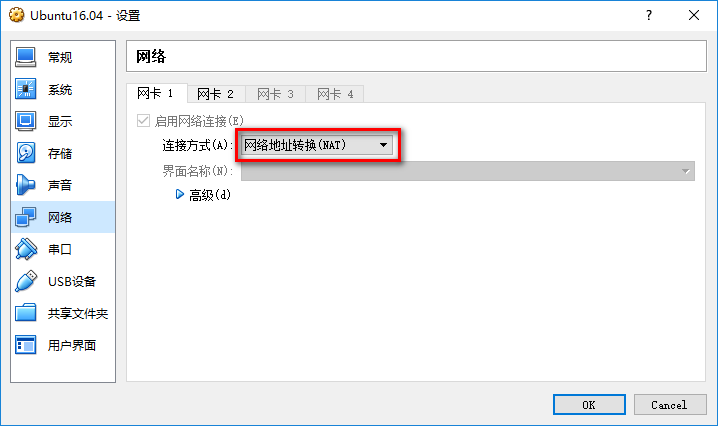
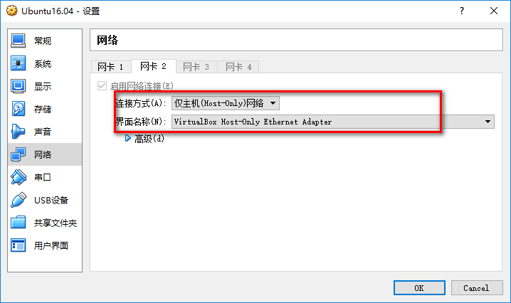
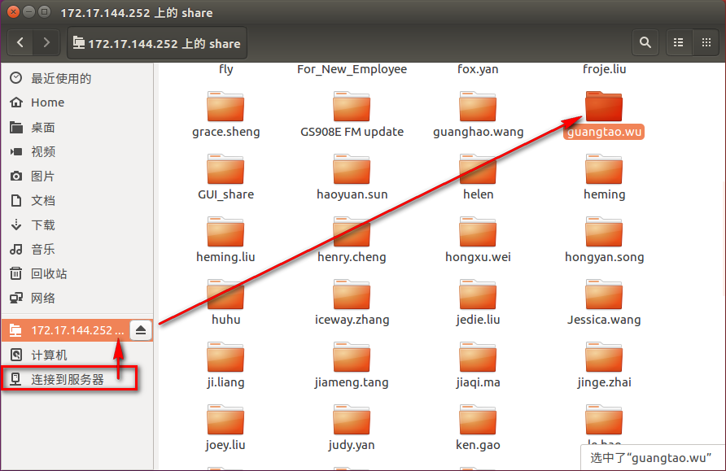
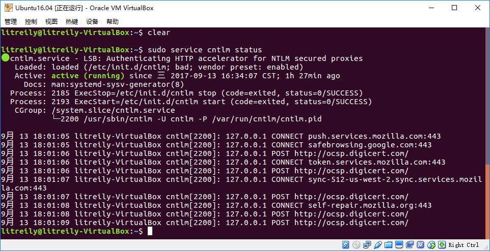
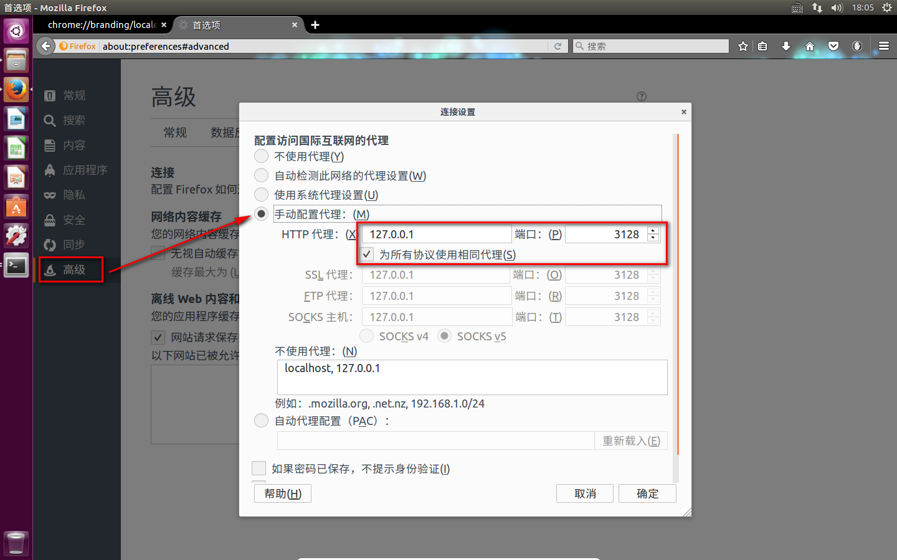
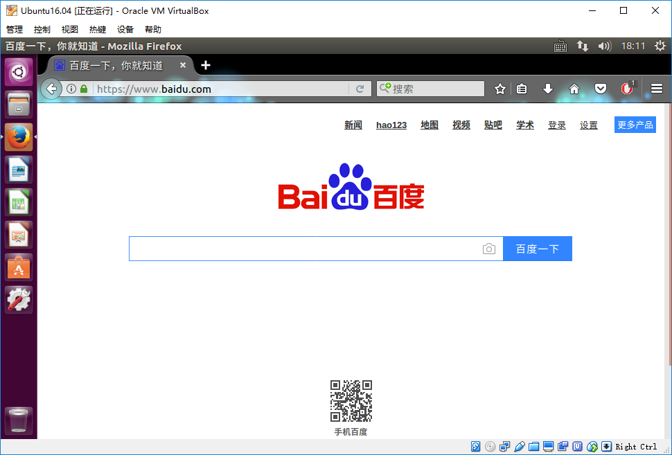
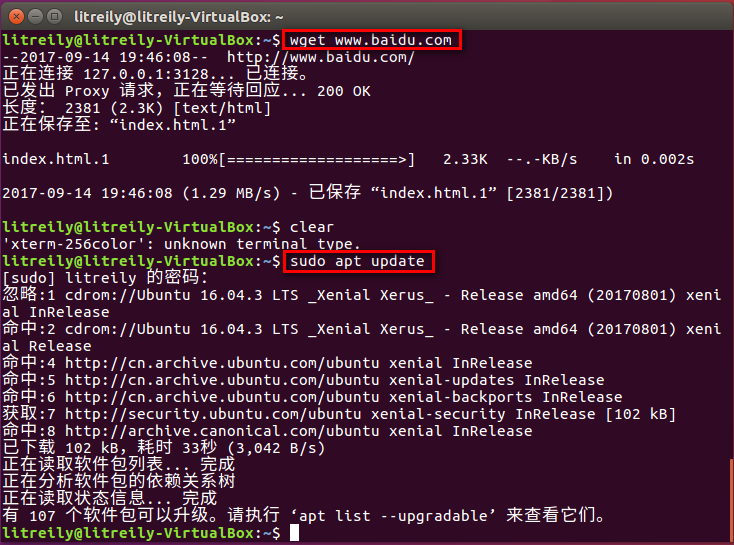

# cntlm

## description

在公司电脑上用`Virtual Box`装了个`Ubuntu 16.04`的虚拟机，但是无法上网，后经高人指点，使用代理服务器`cntlm`成功上网，谨以此文以记之。

## config

### Virtual Machine

打开`Virtual Box`的配置界面，在网络选项中选择网卡1，设置连接方式为**网络地址转换（NAT）**。



在网卡2中设置连接方式为**仅主机(host-only)网络**，并选择界面名称为虚拟机默认安装的虚拟网卡。



### Install cntlm

首先在 Windows PC 中下载`cntlm`的安装包，版本应与所装的虚拟机版本相匹配，本人安装的是`cntlm_0.92.3-1_amd64.deb`；

然后通过公司的共享服务器`172.17.144.252`可以将文件传入虚拟机中的`Ubuntu`，打开共享服务器时，在连接界面选择匿名即可；



最后将安装包复制粘贴到虚拟机桌面，执行`dpkg -i`完成`cntlm`的安装;

### Config cntlm

打开配置文件，然后修改其中的几项参数

``` bash
$ sudo vi /etc/cntlm.conf
Username    Guangtao.Wu
Domain      delta
Password    ***********

Proxy       172.***.***.10:8080

Listen      3128
```

配置好后，执行`sudo service cntlm start`即可启动服务器，其它还可以使用的指令有：

``` bash
Usage: /etc/init.d/cntlm {start|stop|restart|reload|force-reload|status}
```

启动后查看服务器状态如下：



### Config bash & apt

为了让`bash`能够正常上网，需要修改`.bashrc`:

``` bash
$ vi .bashrc
export http_proxy="http://127.0.0.1:3128"
export https_proxy="http://127.0.0.1:3128"
export ftp_proxy="http://127.0.0.1:3128"
$ source .bashrc
$ wget www.baidu.com   # test
```

之后，在`/etc/apt/apt.conf.d/`文件夹中添加一个文件，名称任意，此处命名为`25apt`，然后以**管理员身份**加入以下语句，注意每句后面都有**分号**！

``` bash
$ sudo  vi /etc/apt/apt.conf.d/25apt
Acquire::http::proxy "http://127.0.0.1:3128/";
Acquire::https::proxy "http://127.0.0.1:3128/";
Acquire::ftp::proxy "http://127.0.0.1:3128/";
$ sudo apt update    # test
```

### Config browser

打开默认的`firefox`浏览器，在【首选项】->【高级】->【网络】->【设置】中，添加`cntlm`的代理:



## Test Network



到此就能在虚拟机中通过公司代理上网了。



`bash`中也能正常访问网络.
