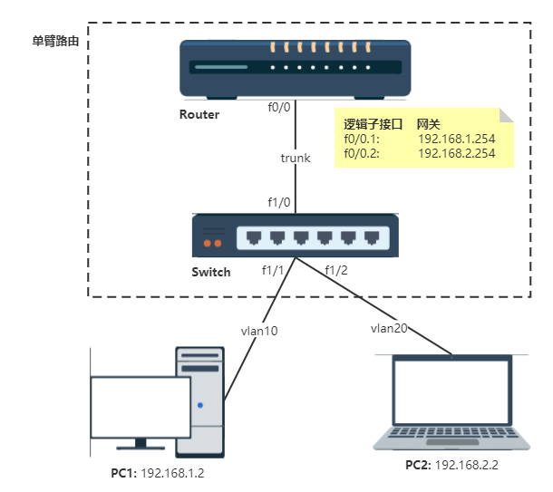

# 单臂路由

设想在一个公司，有多个部门（领导部，财务部、研发部、资讯部等），为了防止广播风暴，也为了方便管理，每个部门被分配在不同的vlan网络中，但是部门之间不能正常通信。因此，如果领导部想要和研发部沟通，就需要把部门对应的两个vlan互联起来，而互联就可以用到 **单臂路由**。

如上图所示，假设PC1属于领导部，PC2属于研发部，他们处于不同的vlan，也就对应不同的网段

- PC1: 192.168.1.2 (192.168.1/24)
- PC2: 192.168.2.2 (192.168.2/24)

交换机配置好了两个vlan，vlan10, vlan20, 分别对应这两个网络，现在为了让PC1 ping 通 PC2，单单靠交换机Switch是无法实现的（因为交换机只负责转发同网段的数据包），这时需要顶部的路由器Router。

通常路由器的收发是一个网口进，另一个网口出，但是作为单臂路由，数据包的收发都在同一个物理网口，只不过这个网口虚拟出了多个子网口，被称为逻辑子接口，也就是图中的`f0/0.1`, `f0/0.2`. 在路由器中，需要配置这两个子网口的网关：

- f0/0.1: 192.168.1.254 (netmask: 255.255.255.0)
- f0/0.2: 192.168.2.254 (netmask: 255.255.255.0)

!!! tips
    注意路由器与交换机之间是 **trunk** 链路，可以收发多个vlan的报文

当交换机和路由器都配置好后，PC1就能够 ping 通PC2, 这也意味着两个 vlan 网络能够正常通信了。

## 小结

**单臂路由** 是指在路由器的一个接口上通过配置子接口方式，实现原本互不相通的VLAN网络之间的网络互联的一种技术。在单臂路由中， **交换机负责vlan标签的封装和拆除，而路由器负责路由转发和vlan转换** 。

## 参考

- [三层交换机——一次路由，多次转发之单臂路由](https://blog.51cto.com/14557673/2443942)
- [一朵浊浪映天地 - 单臂路由](https://vvl.me/2019/10/one-armed-router/)
